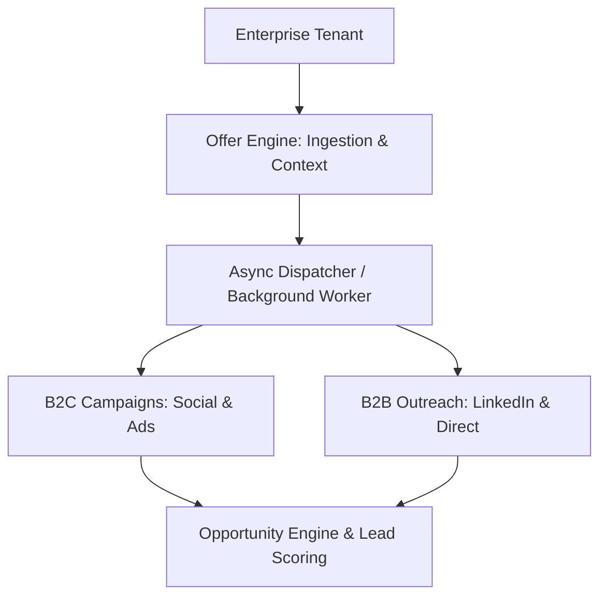

# MasterTech Growth OS — Acquisition & Distribution Engine

> Multi-tenant platform designed to automate audience targeting, campaign generation, commercial opportunity detection, and lead scoring.

---

## Overview

**MasterTech Growth OS** is an acquisition platform that decouples campaign generation and commercial intelligence from ad delivery channels. It ingests high-level business offers and transforms them into multi-channel campaigns (B2C & B2B) while evaluating inbound and detected business opportunities through a deterministic lead scoring algorithm.

---

## Architecture & System Design



### Core Engines

1. **Multi-Tenancy Isolation**: Strict logical data isolation across all relational models (`Tenant`, `Offer`, `Campaign`, `Lead`).

2. **Offer Engine**: Converts business offers (product, location, target audience, price, and commercial objective) into actionable distribution assets.

3. **Decoupled Campaign Generation**: Asynchronous background engine producing channel-specific B2C and B2B marketing assets.

4. **Opportunity & Scoring Engine**: Evaluates commercial leads using a weighted 100-point deterministic algorithm:

   - **Industry Match**: +20 pts
   - **Location Match**: +15 pts
   - **Detected Need**: +25 pts
   - **Qualified Budget**: +20 pts
   - **Prior Interaction**: +10 pts
   - **Favorable Timing**: +10 pts

### Priority Classification

- **90 - 100**: `CRITICAL_HOT`
- **70 - 89**: `HIGH`
- **40 - 69**: `MEDIUM`
- **0 - 39**: `LOW`

---

## Tech Stack

- **Runtime**: Node.js v24 + TypeScript (powered by `tsx`)
- **Web Framework**: Express.js
- **ORM & Database**: Prisma ORM with SQLite (PostgreSQL compatible)
- **Architecture**: Modular Monorepo pattern

---

## Quickstart

### Prerequisites

- Node.js 18+
- npm

### Installation & Execution

1. Clone the repository:

```bash
git clone https://github.com/andres-olguin/mastertech-growth-os.git
cd mastertech-growth-os
```

2. Install dependencies:

```bash
npm install
```

3. Synchronize database schema:

```bash
npx prisma db push --schema=packages/database/prisma/schema.prisma
```

4. Start API server:

```bash
npm run dev:api
```

The server will listen on `http://localhost:4000`.

---

## API Reference

### 1. Tenants

- `POST /api/tenants`

  Creates an isolated enterprise tenant.

  **Payload:**

```json
{
  "name": "Productora Viña Eventos",
  "slug": "vina-eventos"
}
```

---

### 2. Offers & Campaign Generation

- `POST /api/tenants/:tenantId/offers`

  Ingests an offer and triggers asynchronous campaign creation.

  **Payload:**

```json
{
  "title": "Banquetería Matrimonial Premium",
  "targetCity": "Viña del Mar",
  "price": 45000,
  "audience": "Parejas, Centros de Eventos",
  "objective": "Generar cotizaciones"
}
```

- `GET /api/tenants/:tenantId/campaigns`

  Fetches all generated campaigns for the tenant.

---

### 3. Opportunity Engine & Lead Scoring

- `POST /api/tenants/:tenantId/leads`

  Ingests a prospect, computes the weighted score, and assigns priority tier.

  **Payload:**

```json
{
  "companyName": "Hotel Mar del Plata Eventos",
  "contactEmail": "gerencia@hotelmardelplata.cl",
  "city": "Viña del Mar",
  "industry": "Hotelería y Turismo",
  "budget": 3500000,
  "criteria": {
    "industryMatch": true,
    "locationMatch": true,
    "needDetected": true,
    "budgetQualified": true,
    "priorEngagement": false,
    "favorableTiming": true
  }
}
```

- `GET /api/tenants/:tenantId/leads`

  Returns tenant leads ranked by score in descending order.

---

## License

MIT